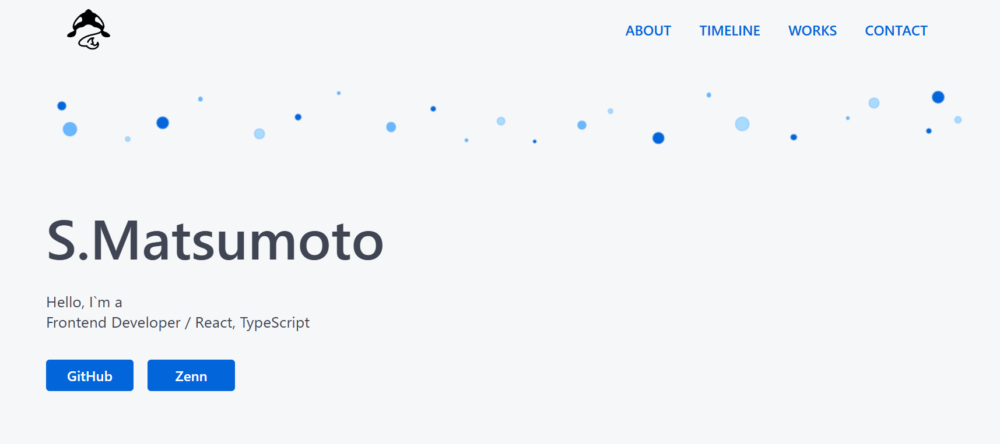

# Portfolio

## 🔗 URL

👉 https://portfolio-silk-tau-42.vercel.app/

---

## 🧑‍💻 About

フロントエンドを中心に開発しているエンジニアです。  
React / Next.js を用いた Web アプリケーション開発を得意としています。

バックエンド（NestJS / Prisma）も含め、  
設計〜実装まで一貫して対応可能なフルスタック開発経験があります。

---

## 🎯 このポートフォリオについて

本ポートフォリオは、これまでの経験・制作物を整理し、  
「構造と設計の分かりやすさ」に重点を置いて構築しています。

単なる見た目ではなく、

- 保守しやすい構成
- 再利用可能なコンポーネント設計
- 責務分離されたアーキテクチャ

を意識して設計しています。

---

## 🧩 コンテンツ

- About（自己紹介）
- Timeline（職歴）
- Works（制作物）
- Contact

---

## 🛠 技術スタック

### Frontend

- Next.js（App Router）
- React
- TypeScript

### Styling

- CSS Modules
- Design Tokens（カラースケール / スペーシング）

### その他

- ESLint
- Prettier

---

## 💡 こだわりポイント

### 🧱 コンポーネント設計

- feature単位での分割により責務を明確化
- `ui / layout / features` の分離による再利用性向上

### 🎨 スタイル設計

- Design Token による一元管理
- グローバルとコンポーネントスコープの明確な分離

### ⚙️ アーキテクチャ

- Server / Client Component の責務分離
- Client Component の最小化によるパフォーマンス最適化
- App Router に最適化されたディレクトリ構成

---

## 📸 スクリーンショット



---

## 🏗 ディレクトリ構成

```plaintext
app/
  components/
    layout/     # レイアウト系（Section / Stack など）
    ui/         # 汎用UI（Button / Link / Badge など）
    features/   # 機能単位（About / Works など）
  globals.css
  layout.tsx
  page.tsx
```
